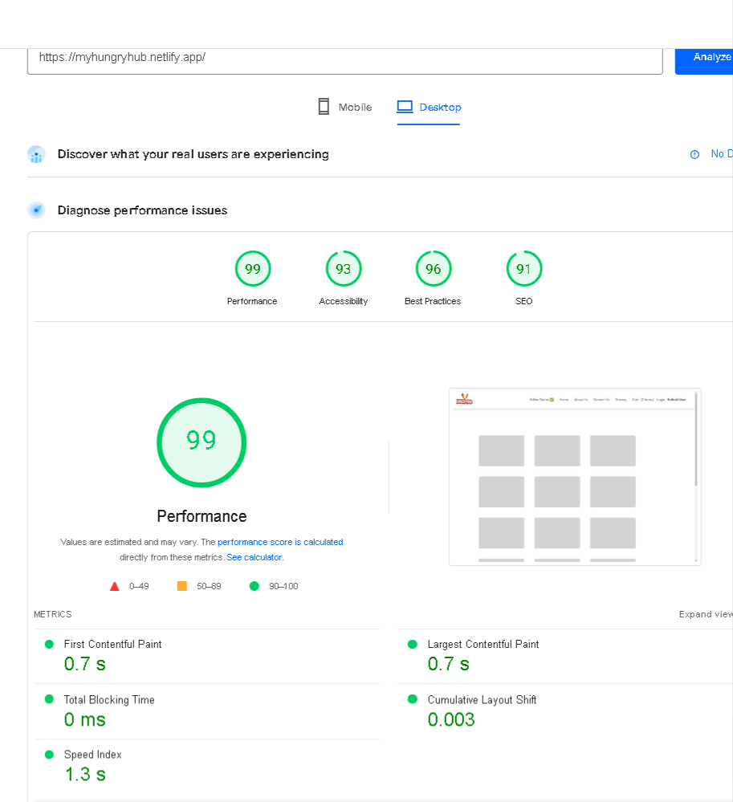

## THE LIVE LINK WON'T WORK ⚠️⚠️

The **LIVE LINK may NOT work** as **the project is utilizing Swiggiy's live API**, and **it keeps changing time to time so the code breaks**.

**The structure of objects within Swiggy's live API is dynamic, with updates and changes occurring almost daily. :(**

Therefore, it won't display resturants data live. Therefore I have attached a video demonstrating the working functionalities. [SEE VIDEO DEMO HERE](https://www.loom.com/share/38f40a7fffda4e459d29446e215cb506?sid=6c9a3382-4ae2-447c-a4bd-e2b7870800a1)

## WEB PERFORMANCE && OPTIMIZATION 😮😮😮

Achieved a page load time of just 117ms. (See attached screenshot)

Goal: To enhance the website's performance, ensuring it loads quickly and provides a smooth user experience.

### Generated Report: ⭐

After implementing various optimization strategies, a detailed performance report was generated. You can view the full analysis [here](https://pagespeed.web.dev/analysis/https-myhungryhub-netlify-app/bzjha9jzi4?form_factor=desktop).

### Achieved Results: (Performance Rating of 99)⭐

- **First Contentful Paint (FCP):** 0.7 seconds  
  FCP measures the time it takes for the browser to render the first piece of content from the DOM.

- **Largest Contentful Paint (LCP):** 0.7 seconds  
  LCP measures the time it takes for the browser to render the largest content element on the page.

- **Total Blocking Time (TBT):** 0 ms  
  TBT indicates the total time the main thread is blocked during page load, preventing other tasks from running.

- **Cumulative Layout Shift (CLS):** 0.003
  CLS measures the sum of all unexpected layout shifts of visible elements during page load.

- **Speed Index** 1.3s
  Speed Index shows how quickly the contents of a page are visibly populated.

### Implemented Strategies: ⭐

_Redux Store for Caching:_ Cached frequently used data across the app.
_Code Splitting:_ Divided code into smaller chunks for faster initial load times.
_Lazy Loading with Infinite Scroll:_ Efficiently loaded restaurant data as users scroll.
_Code Optimization:_ Streamlined and optimized the codebase for better performance.
_Conditional Rendering with Shimmer UI:_ Enhanced user experience by showing a loading indicator during data fetching, improving app responsiveness.
_Efficient JSX Rendering:_ Rendered components conditionally based on data, reducing unnecessary load on the browser.

## IDEATION PHASE

- HEADER
  - Logo
  - Nav Items
- BODY
  - Search Bar
  - Resturant Container (contains lot of Resturant Cards)
  - Resturant Card ( Img, Name of Resturant, Star Rating, cuisine, delivery time )
- FOOTER
  - Copyright
  - Name, Address of company
  - Links

### React Hooks -> Normal JS utility function written by facebook developers.

    - Use state() => super powerful state variable in react
    - Use effect() =>
    - Use Params
    - Own Custom Hooks

# INITIAL APP PREVIEW and LAYOUT (conflict driven UI)

## SHIMMER EFFECT | UPDATE 01

## UPDATE 02

## UPDATE : 03

## Tailwind | UPDATE: 04

## UI CHANGES | UPDATE: 05

## ACCORDIANS | UPDATE: 06

## TYPES OF TESTING

- Unit Testing
- Integration Testing
- End to End - e2e Testing

## SETTING UP TESTING IN OUR APP

- Install React Testing Liberary
- Install Jest
- Install Babel Dependencies
- Configure Babel
- Configure Parcel Config file to disable default Babel transpilation
- Jest Configuration (npx jest --init)
- Install jsdom liberary
- Install @babel/preset-react to make JSX work in test cases
- Include @babel/preset-react inside my Babel config
- Install @testing-library/jest-dom

## FOLDER STRUCTURE FOR TESTING

**tests**
Headers.test.js
Headers.test.ts
Headers.spec.js
Headers.spec.ts
